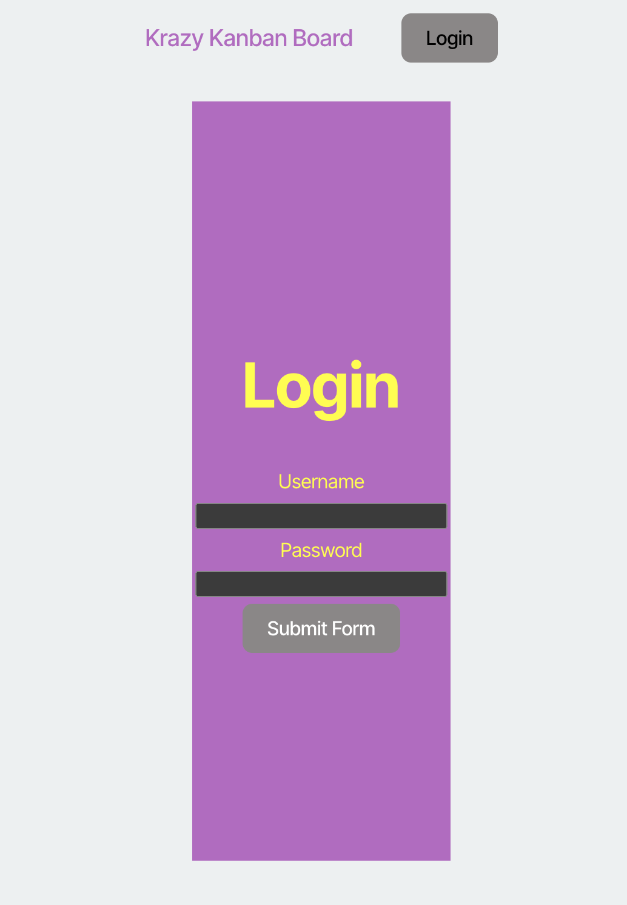
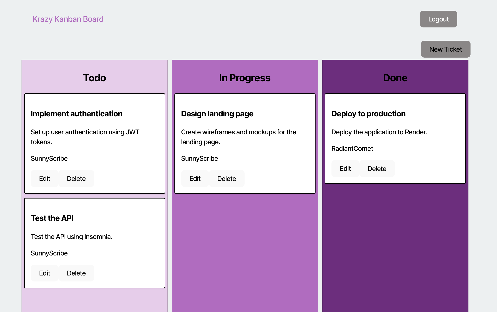
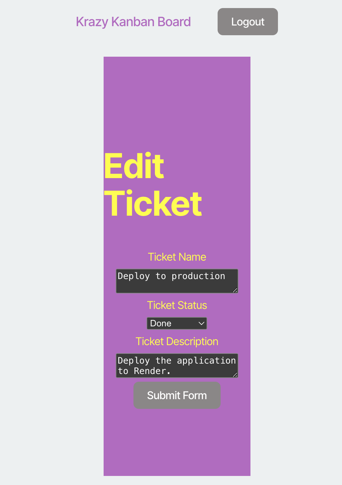

# Kanban Board 

## Description

This application was created in order to make a Kanban Board for users to create tickets and move them to columns for "to do," "in progress," or "done."  The users can also edit or delete the tickets. It was created using Node.js, Express, TypeScript, and utilizing PostgreSQL and Sequelize ORM.  Users can log-in utlizing JWT tokens.  The packages that enable the login are jsonwebtoken and bcrypt. 

## Table of Contents
- [Installation](#installation)
- [Usage](#usage)
- [License](#license)
- [Contributing](#contributing)
- [Tests](#tests)
- [Questions](#questions)

## Installation

After downloading or cloning this repo, create your .env file at the root with 
DB_NAME, 
DB_USER, 
DB_PASSWORD, 
JWT_SECRET_KEY.  The JWT secret key can be any string you choose.  

Check the server/db/schema.sql file for the name of the database and run that file from Postgres to create your database.  

Run ``npx tsc`` to transpile the TypeScript and make sure you have a dist folder.  
Run ``npm install`` to ensure you have all the node modules you need in both the server and the client directories.  
Run ``npm run seed`` to populate the database with tickets and users.  

## Usage

Begin by running ``npm run start`` in the command line. Open up a browser to localhost:3001/login and begin by entering in the login information of a seeded user and clicking the "submit" button.  

 Once logged-in, you can view the Kanban Board.  

 

You can take various actions: 
 1. Change ticket status - todo, in-progress, done
 2. You can click into tickets to edit them. Re-write the description or title 
 3. Delete the ticket
 4. Create a new ticket 

 
The changes of the user will be saved to PostgreSQL and will persist accordingly.   

## License

MIT License

The license for this application is MIT License.

https://opensource.org/license/MIT

## Contributing

Contributors: 

Caryn Carter https://github.com/Caryndcarter 

To contribute, contact carter.caryn@gmail.com.

## Tests

Tests for this application have not been written at this time.  When they are written, they will be added in this section.  

## Questions

For questions visit https://github.com/caryndcarter or write to carter.caryn@gmail.com.

